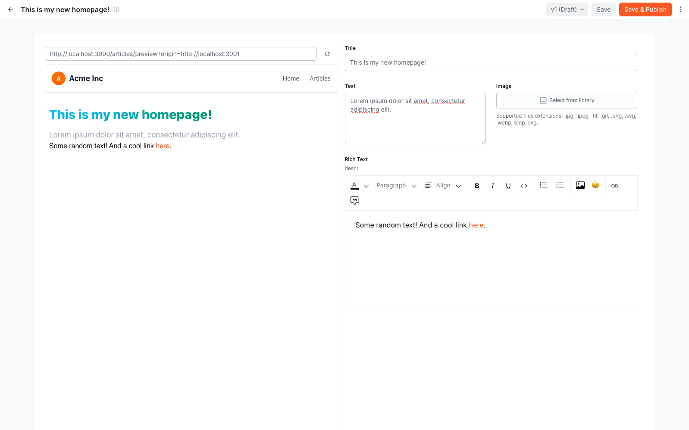

# Live Preview Extension

With the Live Preview extension, you can instantly see changes in your content as you edit it. This extension provides a seamless experience for content creators, allowing them to visualize their work in real-time without needing to publish or refresh the page.

# Overview

This extension consists of:

- **Admin Interface**: a preview pane on the left side of the screen that updates in real-time as you edit content on the right side.
- **Article Model**: a simple content model with a couple of fields

The extension works with a Next.js app which you can clone and host locally. The Next.js app fetches content from the Webiny API and displays it in a simple format. As you edit the content in the Webiny Admin, the changes are sent to the Next.js app, which updates the preview pane in real-time.

The Next.js app can be found here: https://github.com/webiny/learn-webiny-nextjs-app/tree/live-preview-ext
