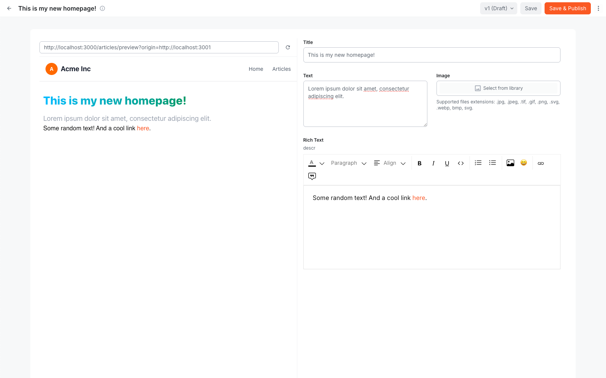

# Live Preview Extension

With the Live Preview extension, you can instantly see changes in your content as you edit it. This extension provides a seamless experience for content creators, allowing them to visualize their work in real-time without needing to publish or refresh the page.

## Install extension

To install the extension run the following command inside your Webiny project:

```shell
yarn webiny extension cms-live-preview
```

Once installed make sure to configure your NextJs/NuxtJs/Angular frontend app to render the pages. To get started clone our reference nextjs app from here: https://github.com/webiny/learn-webiny-nextjs-app/tree/live-preview-ext
Install the dependencies and run the dev server (`yarn dev`)




## Overview

This extension consists of:

- **Admin Interface**: a preview pane on the left side of the screen that updates in real-time as you edit content on the right side.
- **Article Model**: a simple content model with a couple of fields

To add a live preview to an additional content model:
1. Modify `~/extensions/livePreview/admin/AddPreviewPane.tsx` - fine the line below and add your model id to the list:
```ts
const LIVE_PREVIEW_MODEL_IDS = ["article", 'example'];
```

2. Modify `~/extensions/livePreview/admin/getPreviewUrl.ts` - modify the `previewPaths` and add the preview slug for your new content model:
```ts
const previewPaths: Record<string, string> = {
	article: "/articles/preview",
    example: "/examples/preview"
};
```
At the same time also add the `slugPaths`:
```ts
const slugPaths: Record<string, string> = {
	article: "/articles",
	example: "/examples"
};
```

The `previewPaths` variable tell the live preview component - what path to use in your app to render the live preview iframe inside your app for this particular content model.
The `slugPaths` is used together with the value of the `slug` field to compose a path for that entry. For example if we have `/test/path` as the value of the slug field in the example content model, the full slug will look like `/examples/test/path`, and that will be the route that your frontend app will need to handle to render this page.

3. Inside the same `~/extensions/livePreview/admin/getPreviewUrl.ts` file, also modify the `getDomain` function so it returns the live domain of your frontend app.


## Questions

In case of any questions, find us on our community forum: https://www.webiny.com/slack